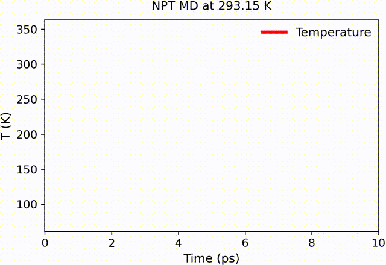

Theory and Background
=====================

TL;DR: Read this page to pick sensible accuracy targets, understand the
convergence report, and know **when your simulation is done**.

Why Understanding This Helps
----------------------------

While you can use ``kim-convergence`` effectively without deep statistical
knowledge, understanding these core concepts will help you:

- **Set realistic accuracy targets** — Choose appropriate ``relative_accuracy``
  or ``absolute_accuracy`` values
- **Interpret results correctly** — Understand what "effective sample size" and
  "confidence intervals" mean for your simulation
- **Troubleshoot effectively** — Know when to switch methods or adjust parameters
- **Trust your convergence** — Be confident that your simulation ran long
  enough, but not longer than necessary

This section explains the statistical foundations in plain language, with
technical details for those who want them. For the original research, see the
:doc:`references`.

The Big Picture: What Problem Are We Solving?
---------------------------------------------

Simulations (molecular dynamics, Monte Carlo, etc.) produce correlated
time-series data. Two fundamental challenges arise:

1. **Equilibration Detection**: When has the system "warmed up" enough that we
   can start collecting meaningful statistics?
2. **Convergence Assessment**: How long should we run to get reliable averages
   with known uncertainty?

Running too short gives biased results; running too long wastes computational
resources. ``kim-convergence`` automates both decisions using established
statistical methods.

*Example: Different observables converge at different rates. Visual inspection
alone cannot determine statistical reliability.*

Core Concepts in Plain Language
-------------------------------

Statistical Inefficiency (Accounting for Correlations)
~~~~~~~~~~~~~~~~~~~~~~~~~~~~~~~~~~~~~~~~~~~~~~~~~~~~~~

Successive simulation steps are *correlated*: the value at step t+1 is similar
to step t. This reduces the effective number of independent samples.

**Think of it this way**: If you have 1000 steps but they're highly correlated,
you might only have the equivalent of 50 independent measurements.

**Statistical inefficiency** (:math:`si`) quantifies this:

- :math:`si = 1` -> steps are perfectly independent
- :math:`si = 10` -> each step has the information of only 0.1 independent
  samples

The effective sample size is:

.. math::

   N_{\text{eff}} = \frac{N}{si}

**What the package does**: Automatically estimates :math:`si` using integrated
autocorrelation time or Geyer's initial monotone sequence, then adjusts
confidence intervals accordingly.

Confidence Intervals (Measuring Uncertainty)
~~~~~~~~~~~~~~~~~~~~~~~~~~~~~~~~~~~~~~~~~~~~

Because we have finite data, our estimate of the mean has uncertainty.
A **confidence interval** gives a range where the true mean likely lies.

**Example**: "300 K ± 3 K with 95% confidence" means:

- We estimate the temperature is 300 K
- We're 95% confident the true temperature is between 297 K and 303 K
- The **half-width** is 3 K

**What the package does**: Computes confidence intervals using various methods
(see below), accounting for correlations via statistical inefficiency.

Accuracy Requirements (When to Stop)
~~~~~~~~~~~~~~~~~~~~~~~~~~~~~~~~~~~~

You specify how precise you need your results:

**Relative accuracy** (most common)
   Target ratio of confidence interval half-width to mean value.
   ``relative_accuracy=0.01`` -> ±1% precision.

   *Use when*: You care about percentage accuracy (e.g., "within 1% of the true
   value").

**Absolute accuracy**
   Target absolute half-width of confidence interval.
   ``absolute_accuracy=0.5`` -> ±0.5 units.

   *Use when*: The magnitude matters more than percentage (e.g.,
   "within 0.5 kJ/mol").

**What the package does**: Continues the simulation until *all* specified
observables meet their accuracy requirements (relative, absolute, or both).

For example, if the density estimate is 0.85 g/cm^3 with a 95% confidence
interval half-width of 0.01 g/cm^3, then

.. math::

   \text{relative-half-width} = \frac{0.01}{0.85} \approx 0.012

If you requested ``relative_accuracy = 0.01`` the run will continue. If you
requested ``relative_accuracy = 0.02`` it would be accepted as converged.

Detailed Algorithm Explanations
-------------------------------

Equilibration Detection
~~~~~~~~~~~~~~~~~~~~~~~

When a simulation starts from non-equilibrium conditions (e.g., minimized
structure, wrong temperature), it goes through a *transient* phase before
reaching *steady state*. Data from the transient phase should be discarded when
computing averages.

The package uses a two-step approach to reliably identify the stationary
(post-equilibration) portion of the trajectory:

1. **Primary detection** with the batched Marginal Standard Error Rule (MSER-m)
   [white1997]_, [spratt1998]_
2. **Refinement** using integrated autocorrelation time analysis (inspired by
   Chodera [chodera2016]_)

**How it works in practice**:

- Start with an initial block of data (``initial_run_length`` steps)
- Apply MSER-m to find candidate truncation points that minimize the standard
  error of the mean
- If a stationary region is detected, refine the truncation point by maximizing
  the effective sample size:

  .. math::
     t_{\text{eq}} = \arg\max_t \frac{N - t}{si(t)}

  where :math:`si(t)` is the statistical inefficiency on the remaining data
  :math:`[t:N]`

- If no satisfactory stationary region is found, extend the trajectory
  geometrically and repeat (up to ``maximum_equilibration_step``)

**Practical implication**: The algorithm automatically discards transient data
and uses only the stationary portion for convergence assessment — without
requiring manual guesses.

.. note::
   **Practical Tip**: If equilibration is not detected within the limit,
   increase ``maximum_run_length`` (which indirectly raises the equilibration
   budget) or check if the system truly reaches steady state (e.g., slow phase
   transitions or glassy systems may need much longer runs).

Statistical Inefficiency and Effective Sample Size
~~~~~~~~~~~~~~~~~~~~~~~~~~~~~~~~~~~~~~~~~~~~~~~~~~

For correlated time series, the statistical inefficiency :math:`si` is computed
from the autocorrelation function:

.. math::
   si = 1 + 2 \sum_{\tau=1}^{N-1} \left(1 - \frac{\tau}{N}\right) \rho(\tau)

where :math:`\rho(\tau)` is the normalized autocorrelation at lag :math:`\tau`.

**Available estimators** (choose via ``si`` parameter):

* **Integrated autocorrelation time** (default) — Standard estimator
* **Geyer's initial monotone sequence** [geyer1992]_, [geyer2011]_ — More
  robust for some correlation structures
* **Split-chain variants** — For improved variance estimation

.. note::
   **Practical Tip**: Use FFT acceleration (``fft=True``, default) for datasets
   with >1000 points. It's much faster with the same accuracy.

Uncertainty Quantification Methods
~~~~~~~~~~~~~~~~~~~~~~~~~~~~~~~~~~

Upper Confidence Limits (UCLs) estimate the uncertainty in mean values.
Different methods are available for different situations:

.. list-table:: Choosing a UCL Method (confidence_interval_approximation_method)
   :widths: 20 30 25 25
   :header-rows: 1

   * - Method
     - Best For
     - Key Idea
     - Speed
   * - ``uncorrelated_sample``
     - Default, most simulations
     - Assumes samples are independent after accounting for statistical
       inefficiency
     - Fast
   * - ``mser_m``
     - Maximum reliability, smaller datasets
     - Minimises standard error of the mean via Marginal Standard Error Rule
       [white1997]_, [spratt1998]_
     - Medium
   * - ``heidelberger_welch``
     - Strongly correlated or periodic data
     - Spectral method working in frequency domain [heidelberger1981]_
     - Medium
   * - ``n_skart``
     - Non-normal distributions, skewed data
     - Non-overlapping batch means with skewness adjustment [tafazzoli2011]_
     - Slow

**MSER-m details**: Finds truncation point minimizing the standard error:

.. math::

   \text{MSER}_m(d) = \frac{1}{(n-d)^2} \sum_{j=d+1}^n (Y_j - \bar{Y}_{d:n})^2

**Batch Means Method**: For correlated data, divides data into non-overlapping
batches and estimates variance from batch means:

.. math::

   \hat{\sigma}^2 = \frac{m}{b-1} \sum_{i=1}^b (\bar{Y}_i - \bar{Y})^2

.. note::

   **Practical Recommendation**: Start with ``uncorrelated_sample``. If you get
   warnings about poor convergence, try ``heidelberger_welch`` for correlated
   data or ``n_skart`` for non-normal distributions.

Advanced Features
-----------------

Population Hypothesis Tests
~~~~~~~~~~~~~~~~~~~~~~~~~~~

When you know the *true* population parameters, you can perform additional tests:

* **t-test**: Compare sample mean to known population mean
* **Chi-square test**: Compare sample variance to known population variance
* **Levene's test**: Test homogeneity of variances
* **Von Neumann test**: Test for randomness [vonneumann1941]_

**Use case**: Validating force fields by comparing to known experimental values.

**Example**: If you know a material's density should be 2.7 g/cm^3 ± 0.1 g/cm^3,
provide ``population_mean=2.7`` and ``population_standard_deviation=0.1``. The
simulation will continue until statistically consistent with these values.

Non-Normal Distributions
~~~~~~~~~~~~~~~~~~~~~~~~

For observables with non-normal distributions (e.g., gamma-distributed
energies), specify the distribution via:

- ``population_cdf``: Distribution name (e.g., ``'gamma'``)
- ``population_args``: Shape parameters
- ``population_loc``: Location parameter
- ``population_scale``: Scale parameter

The algorithm uses appropriate statistical tests for that distribution.

From Theory to Parameters
-------------------------

These statistical concepts translate directly to ``kim-convergence`` parameters
and decisions:

Connecting Concepts to Configuration
~~~~~~~~~~~~~~~~~~~~~~~~~~~~~~~~~~~~

- **Equilibration detection** -> Determines how much initial data to discard
  (reported as ``equilibration_step``)
- **Statistical inefficiency** -> Quantifies data correlation and determines
  ``effective_sample_size``
- **Confidence intervals** -> Define the precision targets via
  ``relative_accuracy`` (percentage) or ``absolute_accuracy`` (absolute units)
- **Upper confidence limit methods** -> Selected via
  ``confidence_interval_approximation_method``:

  - ``uncorrelated_sample``: Assumes independent samples after accounting for
    inefficiency
  - ``heidelberger_welch`` [heidelberger1981]_: Spectral method for correlated
    data
  - ``n_skart`` [tafazzoli2011]_: Handles non-normal/skewed distributions
  - ``mser_m`` [white1997]_, [spratt1998]_: Marginal Standard Error Rule for
    maximum reliability

- **Hypothesis testing** -> Optional validation against known population
  parameters via ``population_mean``, ``population_standard_deviation``, or
  custom distributions

Key Statistical Trade-offs
~~~~~~~~~~~~~~~~~~~~~~~~~~

1. **Accuracy vs. Runtime**: Tighter accuracy (smaller ``relative_accuracy``)
   requires exponentially longer runs but yields more precise estimates.
2. **Bias vs. Variance**: Discarding too little equilibration data introduces
   bias, and discarding too much increases variance. The algorithm finds the
   optimal balance.
3. **Independence vs. Correlation**: High statistical inefficiency reduces
   effective sample size, widening confidence intervals for the same amount of
   data.
4. **Relative vs. Absolute Accuracy**: Relative accuracy works well when means
   are large compared to fluctuations; absolute accuracy is needed when means
   approach zero or percentage precision is physically meaningless.

   When the confidence interval includes zero (``relative_accuracy_undefined``),
   switch to an absolute target.
   *Example*: mean = 0.02 kcal mol^-1, half-width = 0.05 kcal mol^-1 -> set
   ``absolute_accuracy=0.05``.

Interpreting the Convergence Report
~~~~~~~~~~~~~~~~~~~~~~~~~~~~~~~~~~~

Key fields to check:

- ``equilibration_detected``: Whether stationarity was found
- ``equilibration_step``: Where the equilibrated region begins
- ``effective_sample_size``: Independent samples after accounting for correlation
- ``relative_half_width``: Achieved precision relative to mean
- ``upper_confidence_limit``: Absolute half-width of confidence interval
- ``converged``: Whether all statistical criteria were satisfied

Next Steps
~~~~~~~~~~

- Try the copy-paste examples in :doc:`examples`
- See :doc:`best_practices` for production workflows
- Consult :doc:`troubleshooting` for error-specific fixes
- Explore the original papers in :doc:`references` for deeper insight

The goal is reliable, reproducible results with minimal wasted computation. Let
rigorous statistical criteria -- not arbitrary cutoffs -- decide when your
simulation is complete.
